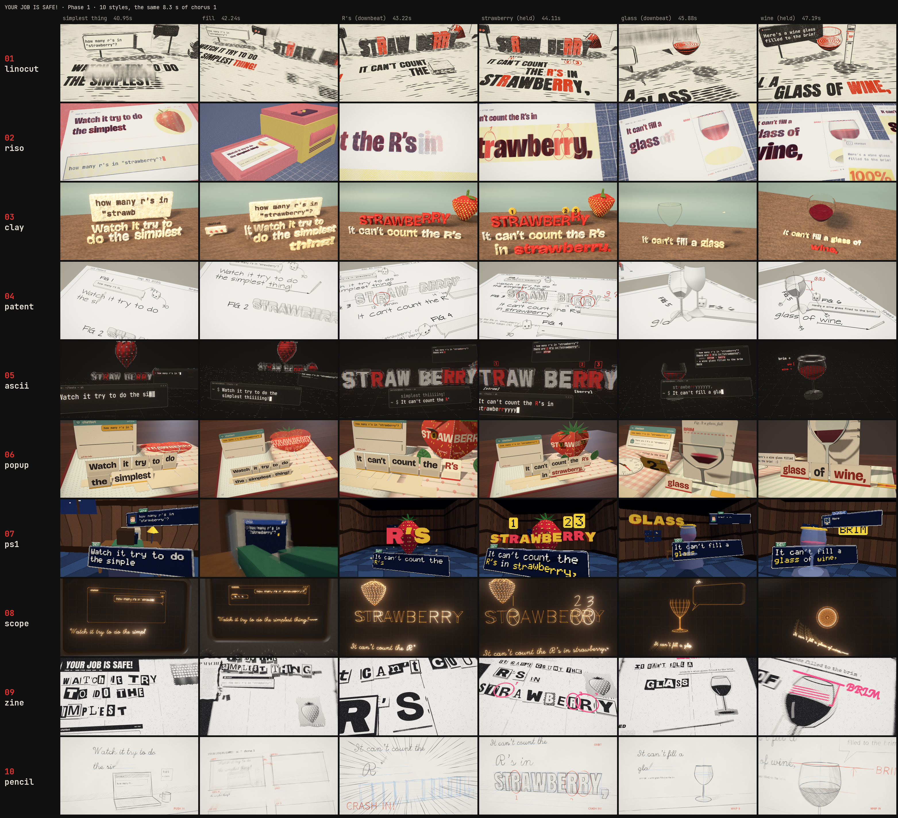

# Your Job Is Safe! — a code-rendered music video

[](https://youtu.be/6t2PD-we2G8)

**Watch it on YouTube: https://youtu.be/6t2PD-we2G8**

🎵 **The song:** [`audio/your-job-is-safe.mp3`](audio/your-job-is-safe.mp3) (3:33, with the cover and the lyrics in its tags)

A satirical pop-punk song for programmers. "AI will replace all programmers by next year." They said that last year
too. So DEV, a smug senior developer in a green hoodie, laughs at every AI fail: the chatbot that can't count the R's
in "strawberry", the wine glass that never fills to the brim, every clock stuck at 10:10, six fingers, 260 McNuggets,
a Waymo circling a parking lot. Then the fails get patched, one by one, while he isn't looking. By the end he has
retrained as a plumber, and the doorbell rings.

The video *is* a forgotten PS1 game, YOUR JOB IS SAFE! (©1999 DEV SOFT): the world renders at 384×216 with snapped,
wobbling vertices and 15-bit dithering, and the chatbot's version badge climbs from v1.0 to v6.0 as its fails get
fixed. No video editor and no stock footage: every frame is a deterministic function of song time, drawn in the
browser with three.js / WebGL and Canvas2D and rendered offline to 1080p60 with motion blur. The lyrics are on screen
for the whole song, synced word by word to the vocal, and staged differently in each scene: typed into chat windows,
scrolled on a drive-thru's LED board, flipped in on an airport departures board, set as clock numerals, ticked off in
a patch-notes inventory menu, whispered out of the fog.

Every fail in the song really happened. The story, the full lyrics and a source for every reference are in
[`handoff.md`](handoff.md); what is on screen, section by section, is in [`out/VIDEO-CONTENTS.md`](out/VIDEO-CONTENTS.md).

The video was made with Claude Code (Opus 5.5): the lyrics, the treatment and style bible, ten style explorations,
the lyric alignment and audio analysis, the 24 scenes of the edit, the thumbnails and the renders were all worked out
in conversation with Claude.

[](out/styles/NOTES.md)

## Credits

- **Blame:** [youtube.com/@noisycoder](https://www.youtube.com/@noisycoder) · [x.com/realnoisycoder](https://x.com/realnoisycoder)
- **Wand:** [NoisyStudio.ai](https://noisystudio.ai)
- **Music & vocals:** generated with [Suno](https://suno.com) (v6) from our lyrics.
- **Lyrics & video:** made with Claude Code, Opus 5.5, plus barely one human.
- **Engine:** the renderer is a fork of [**pdoom-video**](https://github.com/mexicat/pdoom-video) by
  **Giacomo Magnanini ([@mexicat](https://github.com/mexicat))**, the code-rendered video for "I'm Upping My P(doom)".
  Huge thanks: its timeline engine, post-processing, adaptive motion-blur sampler, typography and its approach to
  word-synced lyrics (Demucs stems + CTC forced alignment) are what made this video possible. If you like this one,
  go watch [that one](https://www.youtube.com/watch?v=5EoO5413dBY).

## Layout

- `handoff.md` — the song: concept, the irony and how it works, full lyrics, and every reference case by case with
  sources; `prompt.md` — the brief the video was built from.
- `audio/your-job-is-safe.mp3` — the song (Suno), with the guitar outro; `your-job-is-safe-original-3m24.mp3` — the
  3:24 cut without it. (`video/audio/song.mp3` and `song.original.mp3` are symlinks to them, for the renderer.)
- `video/lyrics/lyrics.src.txt` — the lyrics as sung, by section (the aligner's input).
- `video/data/lyrics.json` — word-level lyric timings; `video/data/audio.json` — tempo (~172 BPM), beats, downbeats,
  sections, kick/snare/hat hits and loudness envelopes of the stems.
- `video/analysis/` — the Python pipeline that produced them: Demucs stem separation, CTC forced alignment of the
  known lyrics (two wav2vec2 models fused, one global Viterbi pass) cross-checked against Whisper, beat analysis
  (beat_this) with grid repair, drum-hit classification.
- `video/app/` — the renderer: TypeScript + three.js, bun + Vite. The engine is in `src/engine/`; the PS1 kit every
  scene is built on (the 384×216 stage, vertex snapping, dither, bitmap font, DEV and the chatbot) in `src/ps1/`; one
  module per scene in `src/scenes/`; the edit in `src/timeline.ts`; the offline renderer in `scripts/`.
- `video/docs/` — `TREATMENT.md` (the treatment, style bible and scene-by-scene plan), `STORY.md`, `ENGINE.md` (the
  scene API), `PHASE1-BRIEF.md` (the style exploration brief).
- `out/styles/` — the Phase 1 contact sheet and notes (the ten styles are `src/scenes/style-*.ts`).
- Thumbnails are scenes too: 30 staged compositions in `src/scenes/thumb.ts`, rendered by `scripts/thumbs3d.ts`.

## Preview and render

Requirements: [bun](https://bun.sh), Google Chrome and ffmpeg (with libx264); [uv](https://docs.astral.sh/uv/) only
to re-run the analysis.

```sh
cd video/app
bun install
bunx vite --port 5420   # preview at http://localhost:5420 (space = play, ←/→ seek, [ ] scenes, ?t=90 to start at 1:30)
```

The final render (1920×1080, 60 fps, adaptive motion blur), against a dev server without live reload:

```sh
cd video/app
YJIS_NO_HMR=1 bunx vite --port 5420 --strictPort &
bun scripts/final.ts --jobs 2   # out/your-job-is-safe.mp4 + out/your-job-is-safe-web.mp4
```

`final.ts` renders one cached segment per scene and re-renders only the scenes whose code, data or options changed,
so a fix to one scene costs one scene; `--gentle` runs it at low priority, and progress is in
`out/.segments-ps1/progress.txt`. There is also a paper-craft skin of the same edit (`?skin=paper`,
`final.ts --skin paper`). Stills, contact sheets, clips and the Phase 1 storybook are in
[`video/README.md`](video/README.md).

## License

The code is released under the [MIT License](LICENSE), like the pdoom-video engine it is built on (whose copyright
notice is kept there and in `video/LICENSE-pdoom-video-engine`). The fonts in `video/app/public/fonts/` keep their
own licenses (SIL Open Font License and others, in `licenses/`). The song (`video/audio/`) and the lyrics are not
covered by the MIT license; the music was generated with Suno and is subject to Suno's terms.
