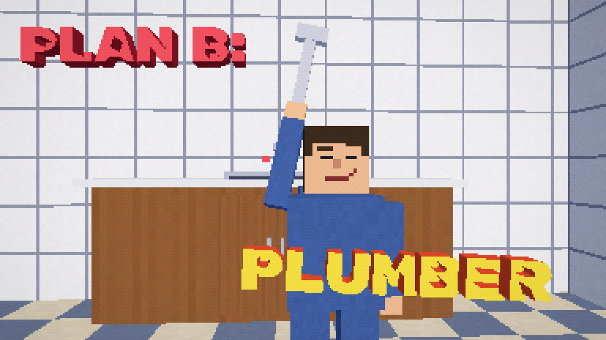
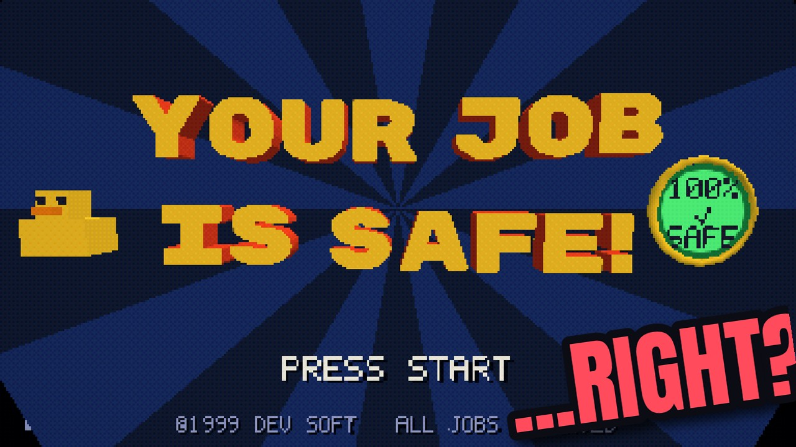
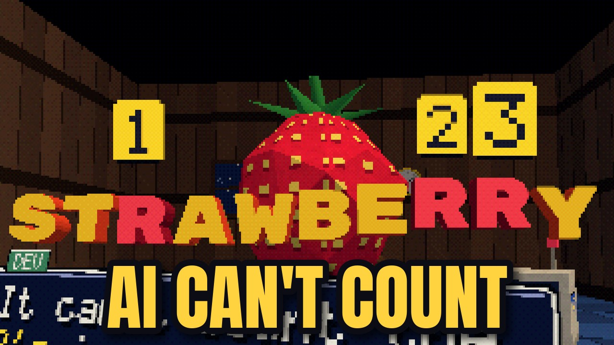
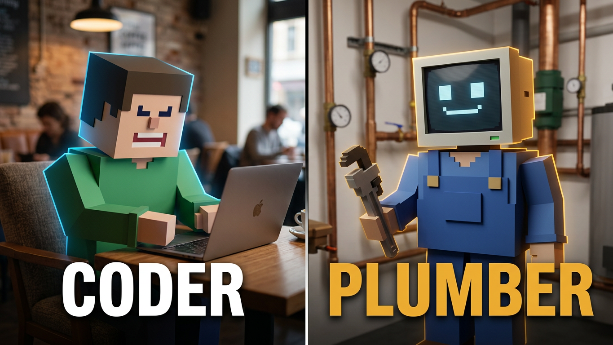
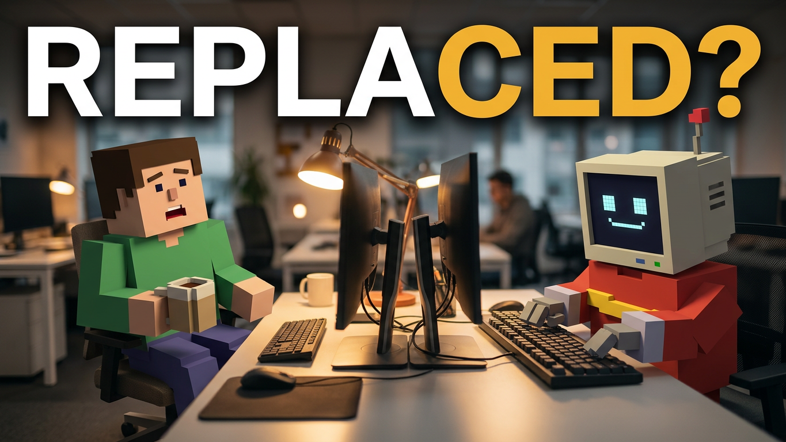
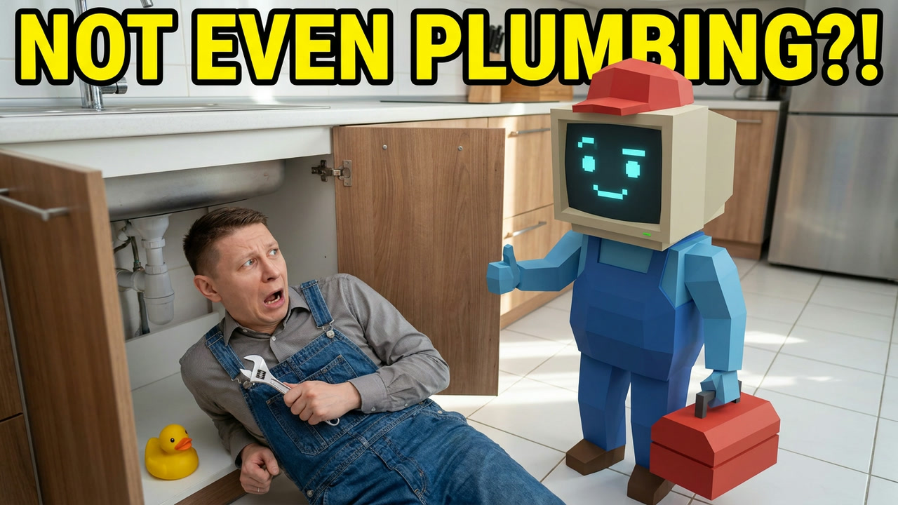

# YouTube thumbnails: A/B tests

The thumbnails tested on the video ([youtu.be/6t2PD-we2G8](https://youtu.be/6t2PD-we2G8)) with YouTube's
Test & Compare, three per run.

## Run 1

All three were rendered by the video's own code, in the video's PS1 look: `a` is a staged 3D composition
(`video/app/src/scenes/thumb.ts`, `?thumb=10`), `b` and `c` are frames of the video with a headline on top
(`video/app/scripts/thumbs.py`). Each was paired with its own title.

| | thumbnail | idea | title |
|---|---|---|---|
| **a** |  | PLAN B: PLUMBER: DEV in overalls, wrench raised, in front of the kitchen | Your Job Is Safe! Right? (Official Music Video) |
| **b** |  | The title screen, YOUR JOB IS SAFE! with "...RIGHT?" slapped on | "You're absolutely right!" (Official Music Video) |
| **c** |  | AI CAN'T COUNT: the strawberry, the chatbot's 2 R's | Your Job Is Safe! (Official Music Video) |

Files: `thumbnail-abtest-batch-1-a.jpg`, `-b.jpg`, `-c.jpg`.

**Result:** a click-through rate of around 1%, too low. The likely reason: in the feed the PS1 look reads as a
screenshot of an old game, not as a music video, and nothing in it grabs a face-first glance. That set up run 2.

## Run 2

Two worlds in one frame: the video's low-poly characters (DEV and the CRT-headed chatbot) as physical objects in
real, photographed places, with real light and reflections, so the thumbnail grabs attention like a photo while still
promising the low-poly video you get after the click.

| | thumbnail | idea |
|---|---|---|
| **a** |  | CODER / PLUMBER: a split, low-poly DEV at his laptop in a café and the chatbot in plumber's overalls with a wrench in a boiler room |
| **b** |  | REPLACED?: low-poly DEV, coffee in hand, staring across the desk at the chatbot typing at the other monitor |
| **c** |  | NOT EVEN PLUMBING?!: the creator himself, photoreal, under a kitchen sink in overalls, while the low-poly robot plumber gives him a thumbs-up (generated with Nano Banana Pro from a portrait reference) |

Files: `thumbnail-abtest-batch-2-a.png`, `-b.png`, `-c.png`.

**Result:** running.
